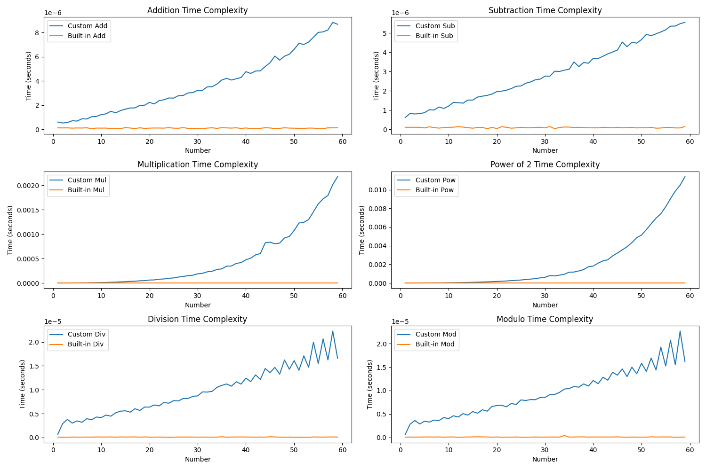

# MathematicsFromScratch

> A Python-based educational implementation of mathematical concepts

## Description

The goal of my journey is to recreate mathematics from nothing, which means I'll start by defining natural numbers and their operations, then same thing for the relative numbers, etc., and see how far I can go.

The make things coherent, once I "created" something, I have the right to use Python's implementation of that thing for the rest of the journey, for example, if I managed to create the natural numbers, I am not forced to use my natural numbers class to create the relative numbers.
It can be seen as a shortcut, but it has no particular meaning to do it in another way as the goal of every class is not to have the most optimized operations, but the most logic ones.

## Tools used

Everything will be implemented in Python, using object oriented programming.

For the testing, I used the followig librairies:
- sys
- os
- matplotlib
- time
- numpy

## Summary

1. Natual Numbers (**DONE**)
2. Relative Numbers (**DONE**)
3. Rational Numbers (**TODO**)

The rest of the list has to be determined, but those objectives already place a nice challenge.

## Documentation

### 1. Natural Numbers

To implement natural numbers, I do not have the right to use...natural numbers.
To do so, I used the [Peano axioms](https://en.wikipedia.org/wiki/Peano_axioms). Basically, I represented numbers using empty lists :
- $0$ is $[]$ *(equivalent to empty set)*
- $1$ is $[[]]$
- $2$ is $[[], [[]]]$
And so on.

#### 1.1 Design Philosophy
- **Peano Axioms**: This class is inspired by the Peano axioms, which define natural numbers based on a 'zero' element and a 'successor' function. The representation of natural numbers as nested lists mimics the concept of recursively applying the successor function.
- **Simplicity and Educational Value**: The focus here is on logic and clarity of the mathematical concepts rather than computational efficiency. This approach is ideal for educational purposes, demonstrating how numbers and operations can be built from fundamental principles.

#### 1.2 Implementation Details
- **Class Structure**: The `NaturalNumbers` class encapsulates the properties and operations of natural numbers. It begins with an empty list representing zero and builds up numbers using the successor method.
- **Successor Function**: The `successor` method is pivotal, representing the Peano axiom of defining a number by the successor of another. Each call to this method nests the current list within another list, incrementing the number.
- **Equivalence Relation**: Thanks to the way the numbers are incremented, to know if two numbers are equal, the funciont just has to look at the last list added to the main list of the number's representation and return True if they are the same and False if not.
- **List Representation**: Nested lists are chosen to visually and functionally represent the successive application of the successor function, aligning with the Peano axioms' recursive nature.

#### 1.3 Operations on Natural Numbers
- **Basic Arithmetic**: The class supports addition (`__add__`), subtraction (`__sub__`), multiplication (`__mul__`), division (`__truediv__`), modulo (`__mod__`), and power (`__pow__`) operations. Each operation is built upon the fundamental concept of the successor function.
- **Comparisons**: It implements comparison methods (`__eq__`, `__ne__`, `__lt__`, `__le__`, `__gt__`, `__ge__`) to allow the comparison of natural numbers, essential for arithmetic operations and logical decisions.
- **Challenges and Limitations**: The recursive list structure, while conceptually clear, is not the most efficient for large numbers. Operations can become computationally intensive as the numbers grow.

#### 1.4 Example Usage
```python
# Creating natural numbers
zero = NaturalNumbers()
one = NaturalNumbers(1)
two = one.copy()
two.successor()

# Basic arithmetic operations
three = one + two
four = two + two
five = four + one

# Comparison
print(one < two)  # Output: True
print(three == two)  # Output: False

# Advanced operations
six = two * three
two_squared = two ** two
```
#### 1.5 Tests and Time
There is a test suite that checks the validity of my operations, I named it `NaturalNumbersTests.py` and you can find it in `NaturalNumbers/Tests`.
It is really large, but I tried to test with a lot of different values, and in a lot of different cases to be able to be as sure as possible that my implementation holds.

With that, I found it interesting to compare the execution time of my functions and those already presents in Python, so I drew plots with the `NaturalNumbersTime.py` file in `NaturalNumbers/Tests`:



Obviously, my functions are bad in execution time, but it was to be expected, the goal of the project is educationnal and absolutely not to create an optimized way to represent numbers (what is done here would be at the opposite).
But it is still interesting to see that as for more complex operations the previous operations are used, the complexity grows pretty fast.

#### 1.6 Conclusion
That first implementation was really interesting to do, espcially from an educational point of view: it is strange to think about operations and comparaisons on natural numbers without using natural numbers.

### 2. Relative numbers
Now, I need to implement relative numbers using natural numbers.
We will define them as ordered pairs of natural numbers $(a, b)$. This representation encompasses both positive and negative values, with $a$ and $b$ representing the positive and negative parts, respectively.
That means that a relative number $c$ will be defined by two natural numbers $(a, b)$ such that $c = a - b$.
This implementation implies that, for example $(3, 1)$ and $(2, 0)$ are equal.

#### 2.1 Design Philosophy
- **Extension of Natural Numbers**: This implementation extends the concept of natural numbers to include negative values, thereby creating a complete set of integers.
- **Balanced Representation**: By representing integers as ordered pairs of natural numbers $(a, b)$, the idea is to balance the positive and negative components, reflecting the true nature of integers.
- **Educational Perspective**: Similar to the approach with natural numbers, the focus is on demonstrating fundamental mathematical concepts logically and clearly, rather than on computational efficiency.

#### 2.2 Implementation Details
- **Class Structure**: The `RelativeNumbers` class encapsulates the properties and operations of integers. Each integer is an ordered pair of natural numbers, where the pair $(a, b)$ represents the integer $(a - b)$. $a$ and $b$ will be stored as the arguments of the class.
- **Equivalence Relation**: Two pairs $(a, b)$ and $(c, d)$ are considered equivalent if $(a + d = b + c)$. This equivalence relation is fundamental in maintaining the integrity of integers.
- **Normalization**: A normalization process is implemented to convert any pair to its standard form, simplifying arithmetic operations.

#### 2.3 Operations on Relative Numbers
- **Arithmetic Operations**: Building upon the natural numbers operations, arithmetic operations for relative numbers are defined. For example, addition is performed as $(a, b) + (c, d) = (a + c, b + d)$.
- **Comparisons**: The class supports comparison methods similar to natural numbers, adapted for the ordered pair structure of relative numbers.

#### 2.4 Conclusion
This part was way easier than the one on natural numbers, mainly because in the first part I had to be creative to find how to complete the operations, but here I just needed to reuse the same principles.